# YAMA — Yet Another Microcontroller Arcade

A 7-game handheld arcade console on a custom ESP32 board with a 2.0" color TFT, rotary encoder, thumbstick, and buzzer — running on the [PixelRoot32](https://github.com/PixelRoot32-Game-Engine/PixelRoot32-Game-Engine) game engine.

> **Work in progress, just for fun.** This is a hobby project, not a finished/final release — balance, polish, and a few features are still in flux. It was **vibe-coded**: built collaboratively with an AI coding assistant, using several other open-source projects as references (see each game's credit below) rather than written from scratch by hand.

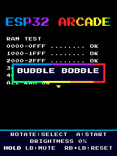

## Features

- **7 playable games** on one shared, animated arcade menu
- Backlight brightness control, mute toggle, and idle auto light-sleep (wakes instantly on any button, resumes exactly where you left off)
- A manual deep-sleep mode for long downtime, woken with a single button press
- High scores saved per-game, persisted across power cycles
- Full analog thumbstick + rotary encoder + button controls, tuned per game

## Games

### Bubble Bobble
Platformer bubble-trap-and-pop action across a multi-screen level — trap enemies in bubbles, then pop them for points.
*Reference: [JulianRijken/BubbleBobble](https://github.com/JulianRijken/BubbleBobble) (sprites/level layout/enemy AI reference, GPL-3.0).*

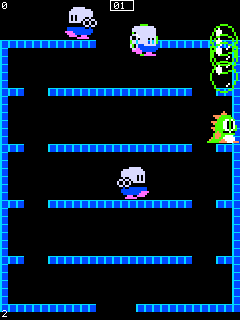 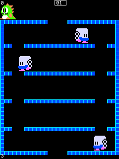

### Pac-Man
Maze chase with full ghost AI (scatter/chase/frightened modes), power pellets, and fruit bonuses.
*Reference: the original arcade Pac-Man (Namco, 1980).*

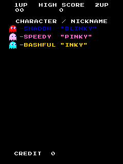 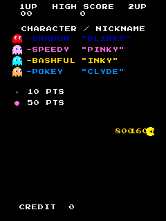

### Galaga
Fixed-shooter with diving enemy formations and the tractor-beam capture/rescue mechanic.
*Reference: the original arcade Galaga (Namco, 1981).*

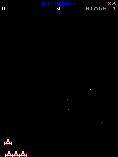 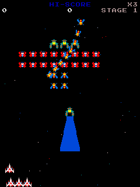

### Arkanoid
Brick-breaking paddle-and-ball action with powerups and a boss fight.
*Reference: the original arcade Arkanoid (Taito, 1986).*

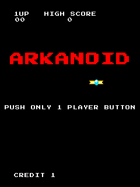 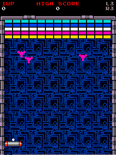

### Block Stack
An original falling-block puzzle game — hold piece, next-piece preview, line clears.
*Reference: the classic falling-block puzzle genre; an original title/rename rather than a direct recreation.*

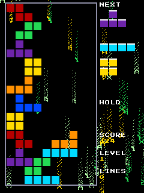 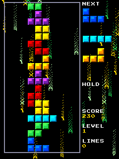

### R-Type
Vertical scrolling shmup: a charge-shot weapon cycling between normal/spread/laser, an auto-firing support drone, drifting enemies and turrets, and a 3-phase boss that splits at low HP.
*Reference: a look-and-feel homage to R-Type (Irem) — original boss design/name and support-drone naming, generic shmup mechanics only.*

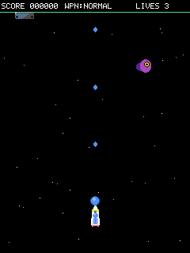 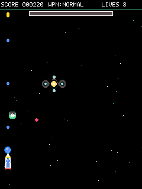

### Dig Dug
Tunnel through dirt, inflate enemies with a pump attack until they burst, or lure them under a rock and dig out its support to crush them.
*Reference: the original arcade Dig Dug (Namco, 1982); [l-hackari/digdug](https://github.com/l-hackari/digdug) consulted for generic mechanics only (original enemy names/art).*

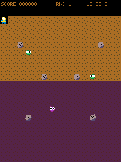 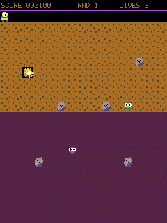

## Hardware

Custom ESP32 board: 2.0" 240x320 ST7789 SPI TFT, EC11 rotary encoder with an onboard button, 2 hand-wired tactile buttons, an analog thumbstick, and a piezo buzzer, powered by a LiPo battery through a boost converter. A custom transistor circuit (high-side PNP switch) gives software control over the backlight — brightness, idle dimming, sleep — instead of it being wired always-on.

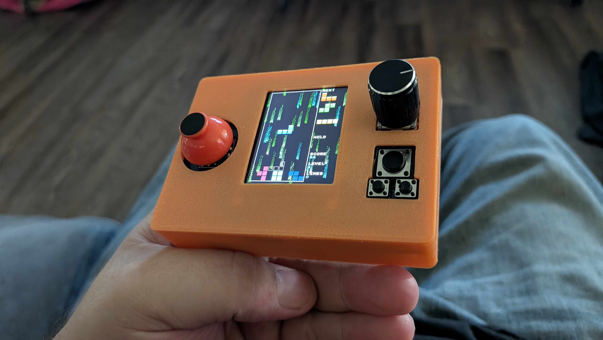 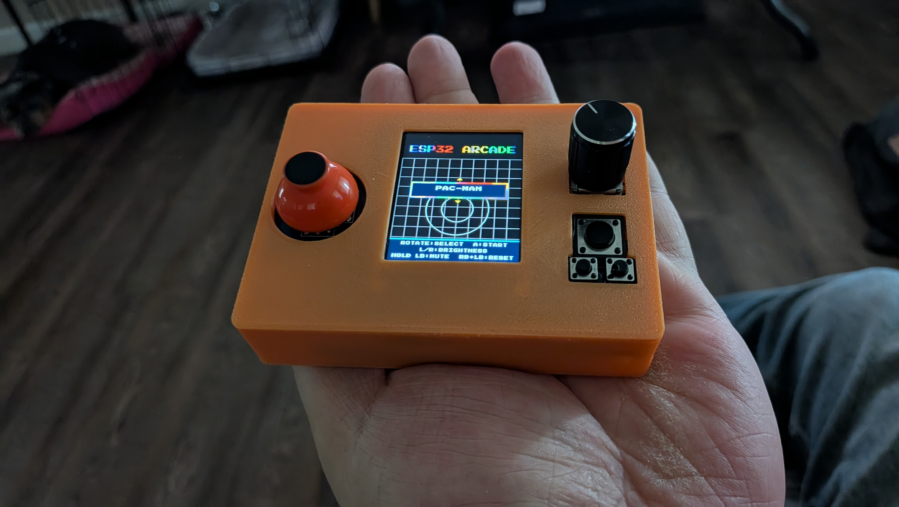

**~$20 to make.** 3D printed case, held together with hot glue, cold solder joints, and dreams.

## Build / flash

```
pio run                                        # build
pio run -t upload --upload-port /dev/ttyUSB0   # flash
pio device monitor -b 115200                   # serial log
```

## Credits

Thanks to these open-source projects, referenced while building the games above:

- **[PixelRoot32 Game Engine](https://github.com/PixelRoot32-Game-Engine/PixelRoot32-Game-Engine)** — the engine this whole console runs on
- **[JulianRijken/BubbleBobble](https://github.com/JulianRijken/BubbleBobble)** (GPL-3.0) — sprite, level layout, and enemy AI reference for Bubble Bobble
- **[l-hackari/digdug](https://github.com/l-hackari/digdug)** — generic mechanics reference for Dig Dug

And thanks to the original arcade games this project takes gameplay inspiration from: Pac-Man (Namco, 1980), Galaga (Namco, 1981), Arkanoid (Taito, 1986), Dig Dug (Namco, 1982), and R-Type (Irem, 1987).

## License

See individual game credits above for third-party reference attribution. This project's own code is otherwise original.
